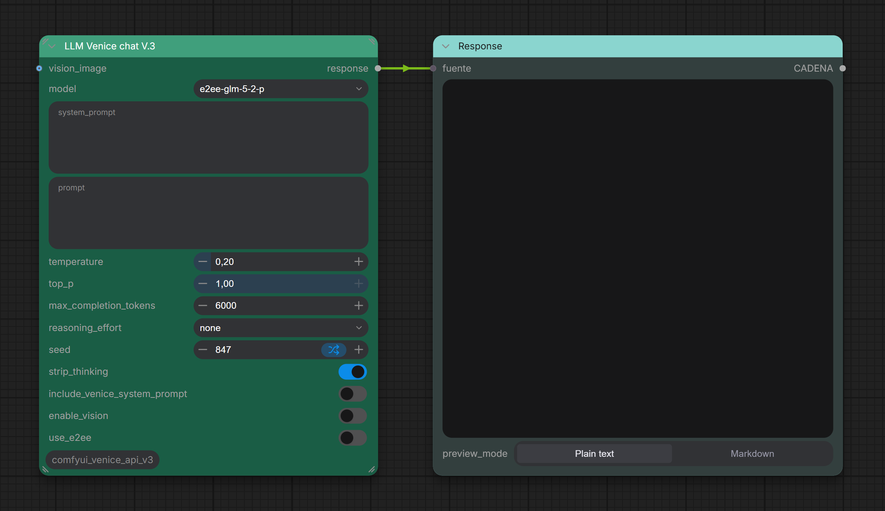

# comfyui_venice_api_v3



A [ComfyUI](https://github.com/comfyanonymous/ComfyUI) custom node for text generation using the [Venice.ai](https://venice.ai) API, built on the ComfyUI v3 node schema.

## Features

- **LLM Venice chat V.3** node — simple, clean interface for Venice.ai text generation
- Full support for **End-to-End Encryption (E2EE)** via Venice TEE (Trusted Execution Environment)
  - Automatically enabled for `e2ee-*` models
  - ECDH secp256k1 + HKDF-SHA256 + AES-256-GCM with per-chunk ephemeral key derivation
- **Reasoning model support** — `reasoning_effort` parameter + `strip_thinking` to get clean output
- **Vision support** — optional image input for vision-capable models
- Dynamic model list fetched from the Venice catalog (cached locally, refreshes every 15 min)
- Errors returned as text output instead of crashing the workflow

## Node inputs

| Input | Type | Default | Description |
|---|---|---|---|
| model | Combo | llama-3.3-70b | Text model to use |
| system_prompt | String | — | Optional system prompt |
| prompt | String | — | User message |
| temperature | Float | 0.20 | Sampling temperature |
| top_p | Float | 1.00 | Nucleus sampling |
| max_completion_tokens | Int | 6000 | Max tokens (includes reasoning) |
| reasoning_effort | Combo | none | none / low / medium / high |
| seed | Int | 1 | Seed (min 1, supports randomize) |
| strip_thinking | Boolean | true | Strip reasoning blocks from output |
| include_venice_system_prompt | Boolean | false | Include Venice's built-in system prompt |
| enable_vision | Boolean | false | Send image to vision-capable model |
| use_e2ee | Boolean | false | Force E2EE (auto for e2ee- models) |
| vision_image | Image | — | Optional image input |

## Installation

1. Clone this repo into your ComfyUI `custom_nodes` folder:
   ```bash
   cd ComfyUI/custom_nodes
   git clone https://github.com/ThinkingBells/comfyui_venice_api_v3.git
   ```

2. Install dependencies:
   ```bash
   pip install -r comfyui_venice_api_v3/requirements.txt
   ```

3. Set your Venice API key:
   - Open ComfyUI and go to **Settings** (⚙️ gear icon, top right)
   - Find the **VeniceAI → API Key** section
   - Paste your key — it is saved automatically
   - Your API key can be obtained at [venice.ai](https://venice.ai) → Account → API Keys

4. Restart ComfyUI. The node appears under the **venice.ai** category as **LLM Venice chat V.3**.

## Requirements

- ComfyUI with v3 node API support (`comfy_api.latest`)
- Python packages: `requests`, `Pillow`, `numpy`, `ecdsa>=0.18.0`, `cryptography>=41.0.0`

## E2EE usage

Select any model whose ID starts with `e2ee-` (e.g. `e2ee-qwen-2-5-7b-p`) — E2EE is enabled automatically. You can also force it on any model by toggling `use_e2ee = true`.

For each request the node:
1. Generates a fresh secp256k1 keypair (never reused).
2. Fetches the TEE attestation from Venice (`/tee/attestation`) with a random nonce.
3. Verifies the nonce in the response matches and that `debug_mode` is not `true`.
4. Encrypts all messages (system + user) with ECDH → HKDF-SHA256 → AES-256-GCM.
5. Sends `X-Venice-TEE-Client-Pub-Key`, `X-Venice-TEE-Model-Pub-Key` and `X-Venice-TEE-Signing-Algo: ecdsa` headers.
6. Decrypts the streaming response chunk by chunk using the per-chunk ephemeral server key.

**Error messages:**
- `[E2EE Error] Model '...' does not support E2EE/TEE attestation` — the selected model has no TEE support; disable `use_e2ee` or select an `e2ee-*` model.
- `[E2EE Warning] The server did not encrypt the response` — the model accepted the attestation but returned the reply in plaintext; E2EE is not fully supported by that specific model.
- `[E2EE Error] E2EE attestation nonce mismatch` — the attestation response may be replayed or tampered; the request was aborted.

## Credits

Based on [DraconicDragon/ComfyUI-Venice-API](https://github.com/DraconicDragon/ComfyUI-Venice-API) (dev-v3schema branch).
